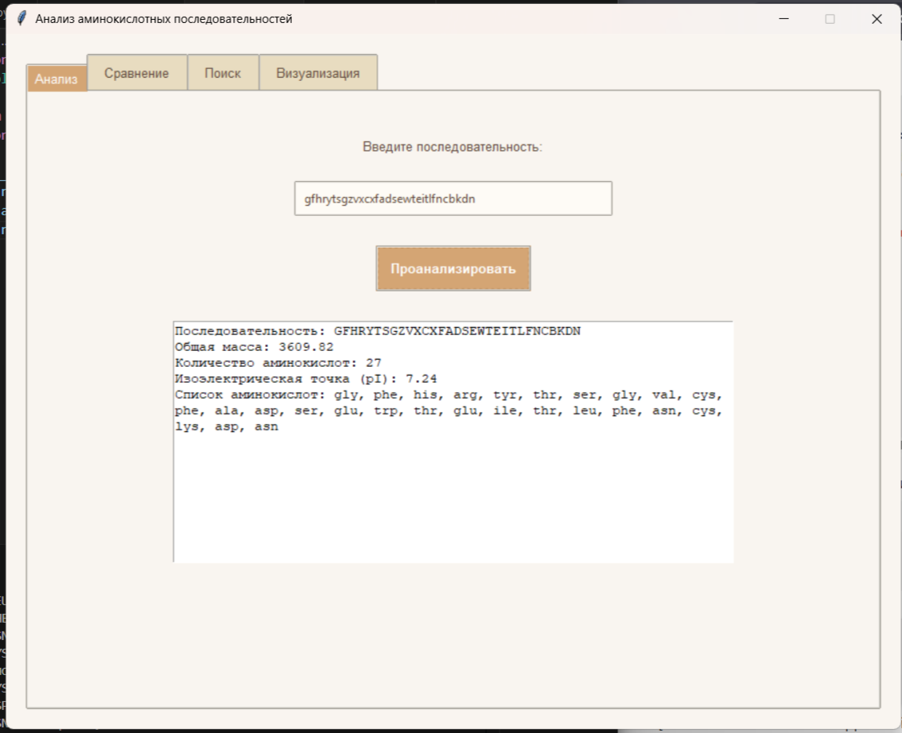

# Анализатор Аминокислотных Последовательностей

[](https://opensource.org/licenses/MIT)
[](https://www.python.org/)
[](https://github.com/Sarasty99/amino-acid-analyze)

Этот инструмент предназначен для базового анализа пептидных цепей. Он позволяет рассчитать массу, состав и массовые доли аминокислот, а также находить вхождения одной последовательности в другую с графическим интерфейсом и продвинутыми функциями визуализации. Разработан с использованием Python и объектно-ориентированного программирования.

### 🌟 Основные обновления (v2.0)
- Полностью переработанный **графический интерфейс (GUI)** с тёплой цветовой схемой
- Интеграция **интерактивной визуализации** данных через matplotlib
- Поддержка **истории анализов** и сравнения последовательностей
- Улучшенная обработка **нестандартных аминокислот**

### 🔍 Возможности

#### 📊 Основной функционал
- 🧬 **Расчет параметров:**
  - Общая масса цепи
  - Изоэлектрическая точка (pI)
  - Гидрофобность/гидрофильность
- 🔬 **Расширенный анализ:**
  - Подробный состав аминокислот (количество, массовая доля)
  - Характеристики радикалов (полярность, заряд)
  - Сравнение двух последовательностей

#### 🎨 Визуальные функции
- 📈 **Интерактивные графики:**
  - Распределение аминокислот (гистограмма)
  - Массовая доля элементов (круговая диаграмма)
  - Оценка гидрофобности (столбчатая диаграмма)
- 💅 **Современный дизайн:**
  - Округлые элементы интерфейса
  - Тёплая пастельная цветовая схема
  - Адаптивная компоновка


### Технические детали

- **Язык программирования:** Python 3.10+
- **Парадигма:** Объектно-ориентированное программирование (ООП)
- **Структура:** Класс `AminoAcids` для представления аминокислоты, словарь для хранения базы данных.
- **Визуализация** Matplotlib, Seaborn
- **Графический интерфейс** Tkinter (Custom Theme)
- **Валидация:** Встроенная проверка ввода на корректность последовательности.
### 🖥 Скриншот интерфейса

### Как использовать

1.  **Клонируйте репозиторий:**
    ```bash
    git clone https://github.com/Sarasty99/amino-acid-analyze.git
    ```
2. **Установите зависимости:**
    ```bash
    pip install -r requirements.txt
    ```
3.  **Запустите скрипт:**
    ```bash
    python main.py
    ```


📌 Важные особенности
✅ Кроссплатформенность (Windows/Linux/macOS)
✅ Оптимизация памяти для длинных последовательностей
✅ Контекстные подсказки и обработка ошибок
✅ Поддержка 20+ стандартных аминокислот


### Планы развития

-[ ] Интеграция с AlphaFold API
-[ ] Экспорт результатов в PDF/CSV
-[ ] Пакетная обработка последовательностей

### Ограничения

- Анализ основан на однобуквенных кодах аминокислот.
- Используется средняя масса аминокислот, которая не учитывает посттрансляционные модификации.

---
*Этот проект разработан в образовательных целях.*
